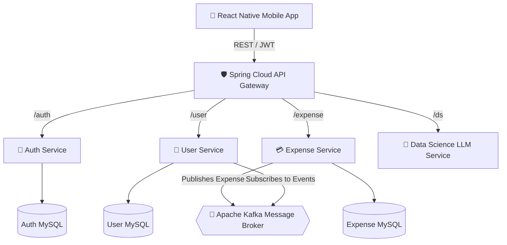

# 💸 ExpenseTracker Pro

An intelligent, full-stack microservices-based mobile application designed to simplify personal finance. Say goodbye to manual spreadsheets and overwhelming transaction histories. **ExpenseTracker Pro** uses AI to automatically categorize expenses, tracks your recurring subscriptions, gamifies your saving habits, and generates beautiful PDF reports.

---

## 🚀 The Problem It Solves
Managing personal finances is often tedious and error-prone. Users struggle to manually enter expenses, forget to cancel recurring subscriptions, and rarely stick to their monthly budgets because they lack real-time insights. 

**ExpenseTracker Pro** solves this by:
1. **AI-Powered Parsing:** Understanding natural language (e.g., "Spent $15 on Starbucks") via an LLM.
2. **Proactive Budgeting:** Breaking monthly budgets down to daily limits and rewarding users with **Streaks 🔥** for staying under budget.
3. **Automated Insights:** Keeping track of sneaky recurring subscriptions and warning you before they renew.

---

## 🏗 Architecture

The system is built on a highly scalable, event-driven **Microservices Architecture** utilizing Java Spring Boot, Apache Kafka, and React Native.



---

## 🛠 Tech Stack

### Frontend (Mobile App)
* **React Native** & **TypeScript**
* **Lucide Icons** & **Gluestack UI** for stunning aesthetics.
* Native modules (`react-native-blob-util`, `react-native-share`) for native file system access and OS share sheets.

### Backend (Microservices)
* **Java 21** & **Spring Boot 3.5+**
* **Spring Cloud Gateway** (WebFlux) for stateless API routing & JWT validation.
* **Apache Kafka** for asynchronous microservice communication.
* **Flyway** for database migrations.
* **OpenPDF** for dynamic, on-the-fly PDF report generation.
* **Python** (dsService) for running LLM inference.

### Infrastructure
* **Docker & Docker Compose**
* **MySQL** (Dedicated schemas per microservice)
* **Zookeeper** (Kafka coordination)

---

## ✨ Standout Features

### 1. Advanced Gamification & Streaks 🔥
The `UserService` runs a nightly Cron job to calculate the user's daily budget limit. It queries the `ExpenseService` for the previous day's spending. If the user successfully stayed under budget, their active saving streak increments, prominently displayed on their profile dashboard.

### 2. Subscription & Recurring Payment Tracker 🔄
Users can manually track their active subscriptions (Netflix, Spotify, Gym). A background worker scans the database to find subscriptions nearing their renewal date and generates preemptive alerts to save the user from unwanted auto-renewals.

### 3. One-Click PDF Monthly Reports 📄
Need to file taxes or reimburse corporate expenses? The backend `ExpenseService` dynamically draws an A4-sized PDF document using `OpenPDF`, perfectly aligning transaction tables and total sums. The React Native frontend caches this file to the native OS file system and immediately launches the iOS/Android Share Sheet.

### 4. Merchant Aliasing
Users can clean up messy bank statement names. By renaming a transaction from `SQ *MERCHANT 123` to `Coffee Shop`, the backend instantly runs a bulk SQL update to retroactively alias all past payments, ensuring clean Insight graphs.

---

## ⚙️ How to Run Locally

### 1. Start Infrastructure
```bash
cd expenseTrackerDeps
docker-compose -f services.yml up -d mysql zookeeper kafka
```

### 2. Start Microservices
Run the following in separate terminal instances:
```bash
cd gatewayService && ./gradlew bootRun
cd authService && ./gradlew bootRun
cd userService && ./gradlew bootRun
cd expenseService && ./gradlew bootRun
```

### 3. Start Mobile App
```bash
cd myExpenseTracker
npm install
cd ios && pod install && cd ..
npm run ios
```

---
*Built with ❤️ and Microservices.*
